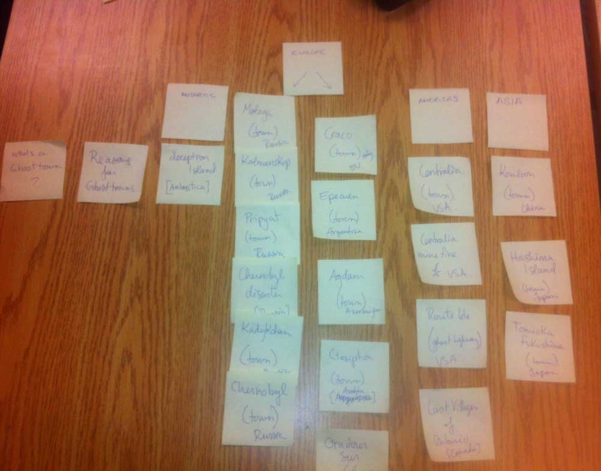
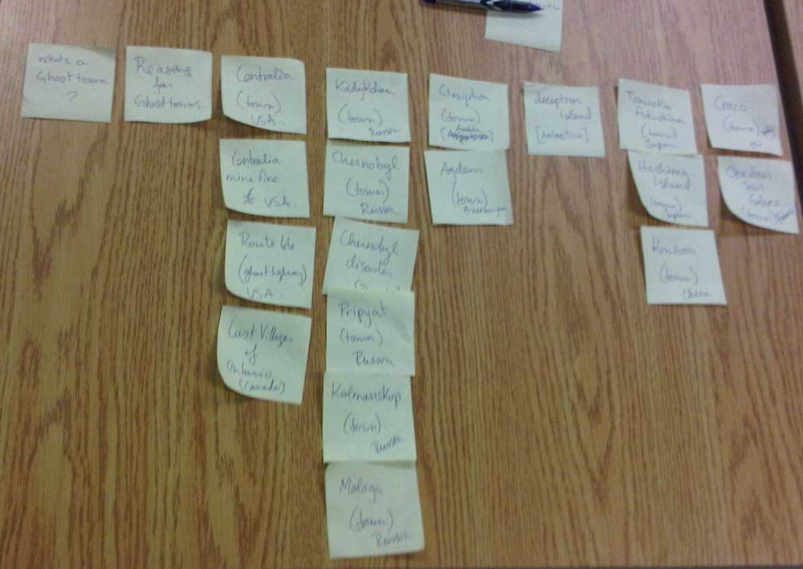

# Card sort report

The purpose of this card sort was to determine common navigation patterns and categories from the content of Ghost Town Large-Data Website.

## Specifics

The card sort was conducted by Aly Mahoney on Sept.12/ 2013 between the times of 11am and 2pm with the following participants:

- Jaime Dean
- Steph Albert

### Cards

20 cards were used covering a broad range of applicable content for the website. The following topics were used as cards:

1. What is a Ghost Town?
2. Reasons for Ghost Towns
3. Chernobyl, city
4. Centralia, USA
5. other towns across the world ...etc.

## Card sort results

*Card sort 1 by Steph Albert*

*Card sort 2 by Jaime Dean*

## Observations

- The participants commonly did not recognise the names of the towns but the general areas of the world they belonged to. Most of there questions were in regards to where these towns were situated in the world.
- The results were very similar to my expectations. 
- Because the cities have their own reasons for being Ghost towns I had to restrain myself from explaining their story. I feel with a little more knowledge their organisation would be different. 
